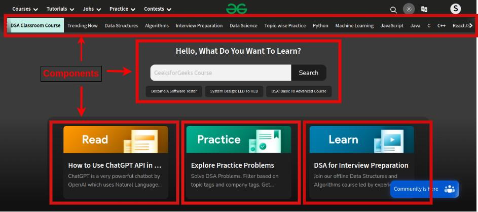

## What is React?

React is a JavaScript library.
It follows the component based approach which helps in building reusable UI components.
It is used for developing complex and interactive web and mobile UI.
Even though it was open-sourced only in 2015, it has one of the largest communities supporting it.

## features of React

It uses the virtual DOM
It uses server-side rendering.
It follows uni-directional data flow or data binding.

## what is virtual dom?

React uses Virtual DOM exists which is like a lightweight copy of the actual DOM(a virtual representation of the DOM).

## How does virtual DOM actually make things faster?

When anything new is added to the application, a virtual DOM is created and it is represented as a tree. Each element in the application is a node in this tree. So, whenever there is a change in the state of any element, a new Virtual DOM tree is created. This new Virtual DOM tree is then compared with the previous Virtual DOM tree and make a note of the changes. After this, it finds the best possible ways to make these changes to the real DOM. Now only the updated elements will get rendered on the page again.

## How virtual DOM Helps React?

React maintains two Virtual DOM at each time, one contains the updated Virtual DOM and one which is just the pre-update version of this updated Virtual DOM. Now it compares the pre-update version with the updated Virtual DOM and figures out what exactly has changed in the DOM like which components have been changed. This process of comparing the current Virtual DOM tree with the previous one is known as ‘diffing’. Once React finds out what exactly has changed then it updates those objects only, on real DOM.

React uses something called batch updates to update the real DOM. It just means that the changes to the real DOM are sent in batches instead of sending any update for a single change in the state of a component.

This entire process of transforming changes to the real DOM is called Reconciliation.

## What is a ReactJS Component?

A Component is one of the core building blocks of React. In other words, we can say that every application you will develop in React will be made up of pieces called components. Components make the task of building UIs much easier. You can see a UI broken down into multiple individual pieces called components and work on them independently and merge them all in a parent component which will be your final UI.

## functional components

Functional components are simpler and more lightweight.
They are basically JavaScript functions that take props (properties) as arguments and return React elements.
Functional components don't have their own internal state or lifecycle methods.
They are also known as stateless components because they don't manage state.

## class based components

Class components are more feature-rich and were the primary way of creating components in React before the introduction of hooks.
They are ES6 classes that extend from React.Component.
Class components have their own internal state and can have lifecycle methods, such as componentDidMount, componentDidUpdate, etc.
They are also known as stateful components because they can manage state.

## stateful and stateless

Stateful components (or stateful widgets) are components that manage their own state. Class components are often stateful, as they can hold and update their internal state.
Stateless components (or stateless widgets) are components that do not manage their own state. Functional components are typically stateless, as they don't have internal state.

The use of hooks has led to a trend where functional components are often preferred over class components for their simplicity and ease of understanding.

Hooks, such as useState and useEffect, allow functional components to have local state and perform side effects, making them more powerful and flexible.

Functional components are easier to read, write, and test. They encourage the use of pure functions, making the code more predictable and maintainable.

Class components, however, may still be relevant in certain situations, especially if you are working with an older codebase or have specific use cases that align well with class-based features.

## Use Functional Components with Hooks When

functional components:
Simplicity is a Priority
Reusability of Logic
Consistent Development Style
Performance Considerations

class based components:
Working with Legacy Code
Need for Lifecycle Methods
Inheritance

## What is JSX?

JSX is a shorthand for JavaScript XML. This is a type of file used by React which utilizes the expressiveness of JavaScript along with HTML like template syntax.

## How different is React’s ES6 syntax when compared to ES5?

require vs import
export vs exports
component and function
props
state

## state management in React

State management in React is the process of storing and managing the data that is used to render a React application. It is an important part of any React application, as it allows the application to keep track of its current state and to update the UI when the state changes.

## how to manage state

The best way to manage state in your React application will depend on the specific needs of your application. If you have a small to medium-sized amount of state, the useState hook is a good option. If you have more complex state management needs, the useReducer hook, Context API, or a global state management library may be a better choice.

There are four main types of state you need to properly manage in your React apps:

Local state
Global state
Server state
URL state
https://www.freecodecamp.org/news/how-to-manage-state-in-your-react-apps/

